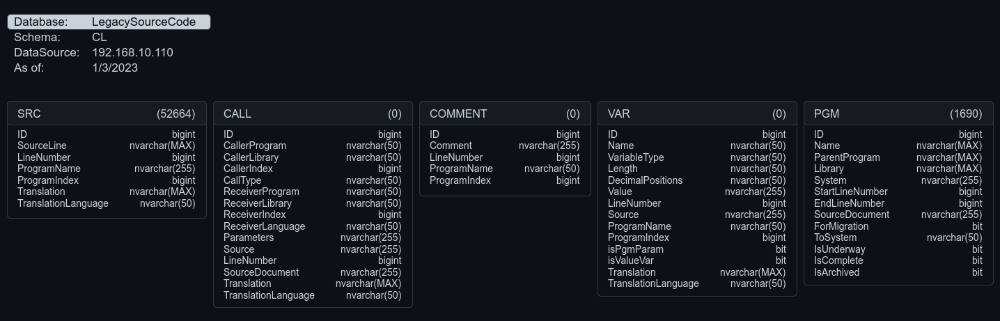

# DatabaseProfiler

# About
This is a quick and dirty C# .NET console app for automatically generating pictures of database schema info to use in documentation. 
Here is an example of an image created for a schema named `CL` in a database named `LegacySourceCode`:

    

# Usage
From the command line, run `DatabaseProfiler.exe` with the following mandatory parameters:

1.  `-d` database name or 'all'
2.  `-o` output path
3.  `-c` standard SQL connection string

The images are created per schema, and the filenames are in `database_schema.png` format.
## Example
If you wanted to generate pictures for a database named `SuperAwesomeDB` on the SQL Server located at `192.168.100.101`, 
and have the generated pictures saved to your desktop, this is what you'd execute at the command line:

`DatabaseProfiler.exe -d "SuperAwesomeDB" -o "C:\Users\CaptainAwesome\Desktop" -c "Data Source=192.168.100.101;User Id=sa;Password=VerySecurePassword12"`

If you wanted to do ALL the databases on the server instead of just one, simply use 'All' as the database name (not case sensitive):

`DatabaseProfiler.exe -d "all" -o "C:\Users\CaptainAwesome\Desktop" -c "Data Source=192.168.100.101;User Id=sa;Password=VerySecurePassword12"`

# Noteworthy Notes to Please Note

 - There is currently little to no error handling. 
 - It's a fairly inefficient design, and isn't particularly fast.
 - It was cobbled together from a few other projects, so the classes don't really make much sense.
 - You can't yet change the colors yourself unless you do so in the code itself.
 - You can't change the font, nor the font size, unless you do so in the code itself.
 - You can't change any part of the generated design unless you do so in the code itself.
 - There is a setting in the code for giving it a transparent background, but...no command line option yet.
 - I needed this for reporting and documentation, so it works as well as I needed it to at the moment.
